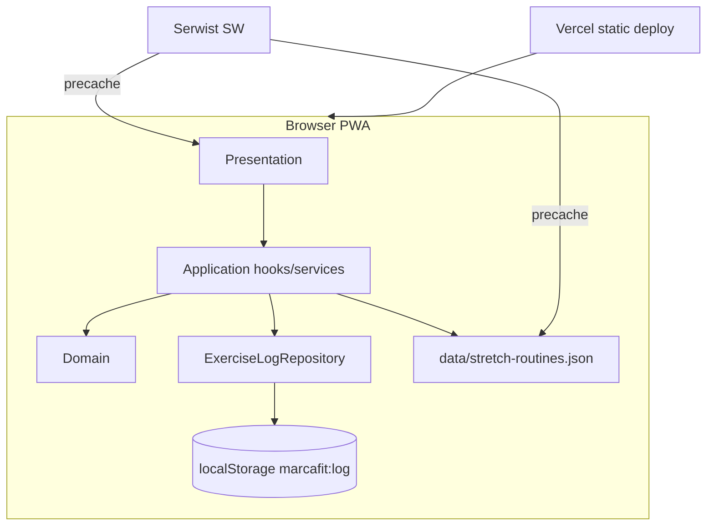
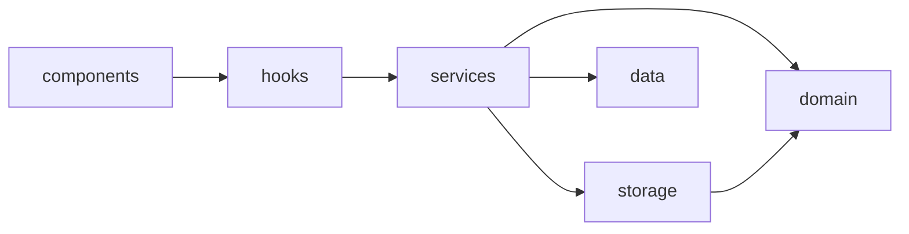
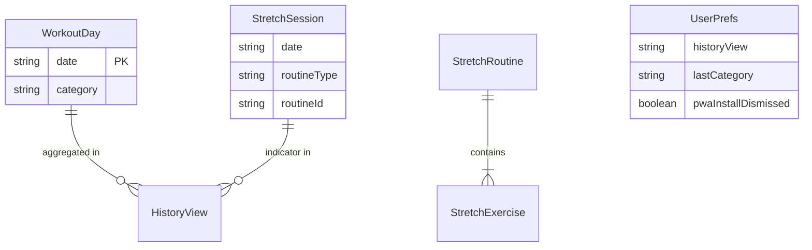

# Architecture Spine — Marca Fit

## Design Paradigm

**Local-first layered client app.** Next.js App Router entrega el shell estático y las rutas; toda la lógica de negocio mutable y la persistencia viven en el cliente. No hay backend propio ni server actions para datos de usuario en MVP.

| Capa | Ubicación | Responsabilidad |
| --- | --- | --- |
| **Presentation** | `app/`, `components/` | UI, navegación, diálogos, Stretch Player |
| **Application** | `lib/hooks/`, `lib/services/` | Orquestación de flujos (marcar día, completar stretch) |
| **Domain** | `lib/domain/` | Tipos, reglas (categorías, ventana 30 días, elegibilidad post-workout) |
| **Infrastructure** | `lib/storage/` | `ExerciseLogRepository` → `localStorage` |
| **Content** | `data/stretch-routines.json` | Rutinas embebidas, read-only en build |



## Invariants & Rules

### AD-1 — Repositorio único de persistencia [ADOPTED]

- **Binds:** `all` state mutation (FR-1, FR-2, FR-4–FR-6, FR-12, Stretch Session)
- **Prevents:** escrituras directas a `localStorage` desde componentes; esquemas JSON divergentes
- **Rule:** Toda lectura/escritura del log pasa por `ExerciseLogRepository` en `lib/storage/`. Una sola clave `marcafit:log`. El repositorio valida, migra versión de schema si aplica, y emite eventos de cambio para React.

### AD-2 — Fechas en timezone local del dispositivo [ADOPTED]

- **Binds:** Workout Day, Stretch Session, History 30 días (FR-3, FR-4)
- **Prevents:** off-by-one por UTC; conteos incorrectos en History
- **Rule:** Fechas persistidas como `YYYY-MM-DD` derivadas de `Intl`/util local (`lib/domain/dates.ts`). “Hoy” siempre se resuelve en cliente al montar, no en servidor.

### AD-3 — WorkoutDay y StretchSession son entidades separadas [ADOPTED]

- **Binds:** FR-7–FR-9, UX RD-1
- **Prevents:** marcar entreno al completar estiramientos; mezclar conteos en History
- **Rule:** `workoutDays[]` y `stretchSessions[]` son arrays independientes en el log. Completar Stretch Player appendea `{ date, routineType, routineId }` a `stretchSessions`. Nunca crea `workoutDays` entry.

### AD-4 — Contenido de estiramientos estático embebido [ADOPTED]

- **Binds:** FR-7, FR-8, FR-12
- **Prevents:** fetch de rutinas en runtime; rotura offline
- **Rule:** Rutinas en `data/stretch-routines.json`, importadas en build. Resolución por `routineId` o mapeo categoría→routine en domain layer. Sin API routes en MVP.

### AD-5 — Post-workout condicionado a categoría concreta [ADOPTED]

- **Binds:** FR-8, FR-14, UX RD-2
- **Prevents:** mostrar sugerencia post-entreno cuando categoría es `no-especificado`
- **Rule:** `PostWorkoutSuggestion` solo renderiza si el Workout Day de hoy tiene `category ∈ { piernas, torso, cardio, cuerpo-completo }`. Omitir chips persiste `no-especificado`; en ese caso la UI no monta la tarjeta post-workout.

### AD-6 — Interacción 100 % client-side para datos de usuario [ADOPTED]

- **Binds:** MVP scope, FR-12
- **Prevents:** dependencia de red para marcar/desmarcar/historial/player
- **Rule:** Sin Server Actions, sin API routes, sin cookies de sesión para el log en MVP. Componentes interactivos son `"use client"`. Server Components solo para layout/shell estático.

### AD-7 — PWA offline vía Serwist + Turbopack [ADOPTED]

- **Binds:** FR-11, FR-12
- **Prevents:** SW obsoleto con webpack-only; shell no cacheado
- **Rule:** `@serwist/turbopack` con route handler `app/serwist/[path]/route.ts`, SW en `app/sw.ts`, registro en `SerwistProvider`. Precache: `/`, assets estáticos, `manifest`, rutinas JSON. Página fallback `app/~offline/page.tsx`.

### AD-8 — Límite de un Workout Day por fecha [ADOPTED]

- **Binds:** FR-1, FR-2, glossary Workout Day
- **Prevents:** duplicados por fecha
- **Rule:** `ExerciseLogRepository.markWorkoutDay(date)` upsert por `date` (máx. uno). `unmarkWorkoutDay(date)` elimina la entrada. Sin edición de fechas pasadas.

### AD-9 — Dirección de dependencias [ADOPTED]

- **Binds:** `all` modules
- **Prevents:** domain importando React; UI importando `localStorage` directo
- **Rule:** `components/` → `lib/hooks|services` → `lib/domain|storage`. `lib/domain` no importa React ni Next. `data/` no importa capas superiores.



## Consistency Conventions

| Concern | Convention |
| --- | --- |
| Naming (entities) | `WorkoutDay`, `StretchSession`, `WorkoutCategory`, `StretchRoutine`, `UserPrefs` — PascalCase types; camelCase JSON fields |
| Naming (files) | kebab-case: `exercise-log-repository.ts`, `use-today-status.ts` |
| Naming (routes) | `/` Home, `/history` History View, `/stretch/[routineId]` Stretch Player |
| Data & formats | Dates `YYYY-MM-DD`; categories `piernas \| torso \| cardio \| cuerpo-completo \| no-especificado`; routineType `daily \| post-workout`; schema version `v: 1` en root del log |
| IDs | `routineId` string slug en JSON (`daily`, `post-piernas`, …); exercise `id` slug dentro de rutina |
| State mutation | Solo vía repository + hooks; hooks propagan con `useSyncExternalStore` o context + reducer |
| Errors | Repository devuelve `Result<T, StorageError>` o lanza errores tipados; UI muestra copy en español, sin códigos técnicos |
| i18n | Español hardcoded en MVP; strings en `lib/copy/es.ts` centralizado |
| Auth | Ninguno MVP |
| Logging | `console.error` en fallos de parse; sin telemetría externa MVP |

### Schema `marcafit:log` (v1)

```json
{
  "v": 1,
  "workoutDays": [
    { "date": "2026-07-11", "category": "piernas" },
    { "date": "2026-07-10", "category": "no-especificado" }
  ],
  "stretchSessions": [
    { "date": "2026-07-11", "routineType": "daily", "routineId": "daily" }
  ],
  "prefs": {
    "historyView": "calendar",
    "lastCategory": "piernas",
    "pwaInstallDismissed": false
  }
}
```

## Stack

| Name | Version |
| --- | --- |
| Node.js | 20 LTS |
| Next.js (App Router) | 15.x |
| React | 19.x |
| TypeScript | 5.x |
| @serwist/turbopack | 9.5.x |
| serwist | 9.5.x |
| Tailwind CSS | 4.x |
| shadcn/ui | latest (Radix primitives) |
| Vercel Hobby | deploy target |
| esbuild | ≥0.25 (Serwist peer) |

## Structural Seed



```text
exercise-app/
  app/
    layout.tsx              # Root + SerwistProvider
    page.tsx                # Home
    history/page.tsx        # History View
    stretch/[routineId]/page.tsx  # Stretch Player
    serwist/[path]/route.ts # SW route handler
    sw.ts                   # Service worker source
    ~offline/page.tsx       # Offline fallback
    manifest.ts             # Web app manifest (or public/manifest.webmanifest)
  components/
    home/                   # Today CTA, category chips, cards
    history/                # Calendar, list, summary
    stretch/                # Player, timer, controls
    ui/                     # shadcn primitives
    pwa/                    # Install banner
  data/
    stretch-routines.json   # 5 rutinas embebidas
  lib/
    domain/
      types.ts
      dates.ts
      categories.ts
      history-range.ts
    storage/
      exercise-log-repository.ts
      schema.ts
    services/
      stretch-resolver.ts   # category → routineId
    hooks/
      use-exercise-log.ts
      use-today.ts
    copy/
      es.ts
  public/
    icons/                  # PWA icons 192/512
```

```mermaid
flowchart TB
  subgraph deploy [Vercel]
    STATIC[Static assets + SSR shell]
  end
  subgraph pwa [Client PWA]
    HOME[/]
    HIST[/history]
    STR[/stretch/:routineId]
    HOME --> HIST
    HOME --> STR
    HIST --> HOME
    STR --> HOME
  end
  STATIC --> pwa
```

## Capability → Architecture Map

| Capability / FR | Lives in | Governed by |
| --- | --- | --- |
| Registro hoy (FR-1–3, FR-14) | `app/page.tsx`, `components/home/`, `use-today.ts` | AD-1, AD-2, AD-5, AD-8 |
| Desmarcar (FR-2) | `components/home/`, repository | AD-1, AD-8 |
| History 30 días (FR-4–6) | `app/history/`, `lib/domain/history-range.ts` | AD-1, AD-2, AD-3 |
| Rutina diaria (FR-7, FR-10) | Home cards, `stretch-resolver.ts` | AD-4 |
| Post-workout (FR-8) | Home cards, `categories.ts` | AD-4, AD-5 |
| Stretch Player (FR-9) | `app/stretch/[routineId]/`, `components/stretch/` | AD-3, AD-4, AD-6 |
| PWA install (FR-11) | `manifest`, `components/pwa/`, Serwist | AD-7 |
| Offline core (FR-12) | Serwist + repository + static JSON | AD-4, AD-6, AD-7 |
| Mobile-first (FR-13) | Tailwind + DESIGN.md tokens | UX/DESIGN companions |
| Stretch Session log | repository + History indicators | AD-3 |

## Deferred

| Item | Reason |
| --- | --- |
| IndexedDB migration | Volumen actual << 5 MB; localStorage suficiente MVP |
| API route `/api/stretch-suggest` + IA | v1.1; addendum |
| Export/import JSON | v1.1 |
| Backend PostgreSQL + sync | Fase 2 |
| Push notifications | Non-goal MVP; iOS PWA limits |
| Dark mode | Post-MVP per UX |
| CI quality gate (Vitest + lint/typecheck; E2E Playwright ± Cucumber) | Post-MVP / tras Epic 4; ver addendum § Futuro — Quality gate en CI/CD |
| Analytics / observability | Hobby personal; sin telemetría MVP |
