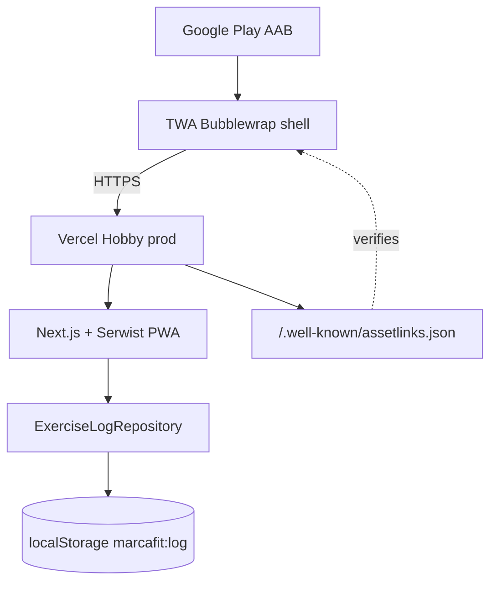

# Sprint Change Proposal — Play Store v1 (Android / Google Play)

**Date:** 2026-07-26  
**Project:** exercise-app (Marca Fit)  
**Trigger:** Pivot estratégico post-MVP — descubrimiento y descarga obvia vía Google Play para usuarios que no conocen la app (no solo “Añadir a pantalla de inicio”).  
**Requested scope:** Oleada **Play Store v1** — solo Android; Capacitor vs TWA a decidir; front en Vercel; local-first OK; premium/cuentas fuera.  
**Mode:** Batch  
**Status:** Draft — revised (edit 2026-07-26: banner UX + diálogo guía) — pending approval  
**Scope:** **Major** (nueva oleada de producto + superficie de distribución; no rollback del MVP)  
**Handoff:** PM / Architect → actualizar PRD + Architecture + Epics; luego sprint-planning / create-epics; implementación **no** empieza hasta docs aprobados

### Revision log

| When | Edit |
| --- | --- |
| 2026-07-26 | **Banner PWA defectivo:** con la app ya instalada, al abrir la misma URL en el navegador (no standalone) el banner “Añadir a inicio” sigue visible. Corregida la asunción de que “solo standalone” basta; añadido bug evidence + Story **5.0** de fix obligatorio antes de assets/Play. |
| 2026-07-26 | **Banner poco útil:** el copy actual (“Añadir a inicio”) no explica casi nada. Ampliar Story **5.0** / **FR-20**: mensaje claro en español + enlace a **diálogo/popup** que explique (1) cómo instalar y (2) cómo funciona la app. Todo el copy en `lib/copy/es.ts`. |

---

## 1. Issue Summary

### Problem

El MVP cerrado (Epics 1–4 + 2.5) cumple el producto local-first como **PWA instalable** (FR-11, UJ-4, banner “Añadir a inicio”). Eso es insuficiente para el nuevo objetivo de distribución:

> Personas que **no conocen** Marca Fit deben poder **encontrarla y descargarla** en Android de forma obvia → **Google Play**.

Hoy el PRD declara explícitamente como non-goal:

> “Publicación en App Store / Google Play (nativa).” (`prd.md` §5)

Eso era correcto para el MVP de hábito personal. El closeout (`mvp-closeout.md`) deja “Deploy a Vercel Hobby” como next step — necesario, pero **no** abre tienda. Sin Play, el embudo sigue siendo URL + install PWA, opaco para usuarios no técnicos.

### Discovery context

- Surfaced **después** del closeout MVP (2026-07-26), no como bug de implementación.
- Tipo: **strategic pivot / market distribution** (no technical limitation del código actual).
- Restricciones del PO: solo Android v1; iOS fuera; sin VPS/backend premium en v1; localStorage viable si se documenta Data safety; Capacitor vs TWA a recomendar.

### Evidence (estado actual)

| Capa | Estado |
| --- | --- |
| Producto MVP | Done en `main` — registro, History, Stretch, multi-select 2.5 |
| PWA | Manifest + Serwist + iconos + banner install (`FR-11`/`FR-12`) |
| Hosting | Diseño Vercel Hobby; producción HTTPS aún puede estar pendiente (closeout) |
| Persistencia | `ExerciseLogRepository` → `localStorage` (`marcafit:log`) — AD-1 |
| Auth / pagos / sync | Explicitamente fuera (PRD §5, AD-6) |
| Tiendas | Non-goal PRD; sin AAB, Play Console ni Digital Asset Links |
| Tracking | `sprint-status.yaml` — Epics 1–4 done; sin epic de tienda |
| **Banner install (1.5)** | **Bug confirmado en prueba móvil (Martin):** PWA ya instalada + visita en Chrome/web → banner sigue saliendo (ver §2.1) |

---

### 2.1 Bug evidence — Banner PWA (Story 1.5 / FR-11)

**Síntoma (PO):** Probando en móvil con la PWA **ya instalada**, al usar la app de forma que acaba en la **web/navegador** (no modo standalone del icono), el banner **“Añadir a inicio” sigue apareciendo**.

**Causa en código (análisis, sin fix aún):**

| Archivo | Comportamiento actual |
| --- | --- |
| `lib/hooks/use-pwa-install.ts` | `isStandalone` = `(display-mode: standalone)` **o** `navigator.standalone` (iOS). No detecta “ya instalada pero abierta en pestaña”. |
| `components/home/pwa-install-banner.tsx` | Oculta solo si `pwaInstallDismissed` **o** `isStandalone`. **No** exige `beforeinstallprompt`. Si no hay prompt, igual pinta el título como `<p>` (líneas 50–51). |

**Por qué falla el escenario real:**

1. Icono home / TWA → `display-mode: standalone` → banner oculto (OK).  
2. Misma URL en Chrome (app instalada, “Abrir en el navegador”, deep link, o hábito de abrir por URL) → **no** es standalone → banner **visible** aunque la instalación ya exista.  
3. Chrome suele **no** disparar `beforeinstallprompt` si ya está instalada → `canPromptInstall === false` → el banner no es actionable, pero **sigue mostrándose** (ruido / sensación de bug).

**Implicación para Play Store v1:** La asunción previa del draft (“dentro de TWA/standalone ya está cubierto”) es **insuficiente**. Hay que endurecer la regla de visibilidad **antes** de screenshots de store y de mezclar copy Play/PWA.

**Regla de producto propuesta (para PRD/UX + Story 5.0):**

El banner solo debe mostrarse cuando la instalación **aún es posible / tiene sentido guiar**:

1. **Nunca** si `display-mode` ∈ {`standalone`, `fullscreen`, `minimal-ui`} o `navigator.standalone`.  
2. **Nunca** si `prefs.pwaInstallDismissed`.  
3. **Android/Chrome:** mostrar **solo** si se recibió `beforeinstallprompt` **o** (refuerzo) `getInstalledRelatedApps()` no lista esta app — preferir ocultar si no hay señal de “instalable ahora”.  
4. **iOS Safari (no standalone):** puede mostrar guía manual (sin BIP); fuera de ese caso, no spamear.  
5. Tras `appinstalled` → ocultar de inmediato (ya parcialmente cableado en el hook).

**Prioridad:** fix + rediseño de mensaje en **Epic 5 Story 5.0** (bloqueante de calidad UX de la oleada; puede ir en paralelo al deploy Vercel, **antes** de capturas Play).

### 2.2 Gap de producto — copy y guía del banner

**Síntoma (PO):** Aunque el banner aparezca, **casi no explica nada**. Falta contexto para alguien que no conoce Marca Fit ni el gesto “Añadir a inicio”.

**Estado actual:** `copy.pwaInstall.title = "Añadir a inicio"` + dismiss; en Android con BIP es un botón de prompt nativo; si no, solo texto estático. No hay explicación de instalación ni de valor del producto.

**Dirección de producto (Story 5.0 / FR-20):**

1. **Banner (compacto, Home):** mensaje en español que diga *por qué* instalar (p. ej. acceso rápido / como app / offline), no solo el verbo “Añadir…”.  
2. **CTA secundario tipo enlace** (“Cómo instalar y usar” o similar) que abre un **diálogo/popup** (mismo patrón de diálogos shadcn ya usado en desmarcar / salir del Player).  
3. **Contenido del diálogo — 100 % español**, centralizado en `lib/copy/es.ts`, con al menos dos bloques:
   - **Cómo funciona Marca Fit** — marcar entreno del día, historial 30 días, estiramientos guiados; sin cuentas; datos en el móvil.  
   - **Cómo instalarla** — pasos según plataforma:
     - Android Chrome: usar “Instalar” del banner/prompt si existe; si no, menú ⋮ → “Instalar app” / “Añadir a pantalla de inicio”.  
     - iOS Safari: Compartir → “Añadir a pantalla de inicio” (pasos cortos).  
   - Nota breve: si más adelante está en Google Play, el diálogo puede mencionar Play como vía preferida (**copy condicional o follow-up** cuando exista listing; en v1 web puede decir “también puedes añadirla a inicio”).  
4. **Acciones del diálogo:** Cerrar; si hay `beforeinstallprompt`, botón primario “Instalar ahora” que dispara el prompt.  
5. **Visibilidad del banner:** sigue regida por FR-19 (no spamear si ya instalada).

**Tone:** español informal, segunda persona, calmado — alineado a EXPERIENCE Voice and Tone. Sin anglicismos innecesarios (“PWA”, “standalone”) en copy de usuario.

---

## 2. Impact Analysis

### Checklist status (batch)

| Section | Items | Status |
| --- | --- | --- |
| 1. Trigger & context | 1.1–1.3 | [x] Done |
| 2. Epic impact | 2.1–2.5 | [x] Done |
| 3. Artifact conflicts | 3.1–3.4 | [x] Done |
| 4. Path forward | 4.1–4.4 | [x] Done — Hybrid: MVP intacto + nueva oleada (Direct Adjustment a nivel backlog post-MVP) |
| 5. Proposal components | 5.1–5.5 | [x] Done (este documento) |
| 6. Final review | 6.1–6.2 | [x] Done — 6.3–6.5 await approval |

### Epic impact

| Epic | Impact |
| --- | --- |
| **Epic 1–4** (done) | **Ninguno funcional obligatorio** salvo follow-up del banner. No marcar 1.5 como “undone”; añadir **Story 5.0** (fix) que supersede el AC de visibilidad. |
| **Story 1.5** (banner PWA) | **Defectivo + insuficiente.** Edge case visibilidad (§2.1) y copy vacío (§2.2). Story **5.0** supersede: visibilidad + mensaje + diálogo guía ES. Convivencia con Play: banner web solo si aún instalable; en TWA oculto. |
| **Nuevos epics** | **Sí — requeridos.** Oleada “Play Store v1” (propuesta Epics 5–7 abajo), empezando por **5.0 banner fix**. |
| **Orden / prioridad** | Post-MVP: (0) **fix banner install** + URL prod HTTPS → (1) packaging TWA + assetlinks → (2) Play Console / listing / privacy → (3) internal testing → (4) producción Play. Premium/cuentas **después**. |

### Artifact conflicts

| Artifact | Conflict | Action |
| --- | --- | --- |
| **PRD** | §5 non-goal Play; Vision “proyecto hobby… PWA”; UJ-4 solo install PWA; §6.2 sin tienda | Añadir **oleada post-MVP “Play Store v1”**; mover Play Android de non-goal a goal de oleada; iOS sigue non-goal; nuevos FR/NFR de distribución + privacidad |
| **Addendum** | Stack = solo PWA Vercel; no menciona wrapper store | Sección “Distribución Android (TWA)”; dominio prod; assetlinks; firma AAB; Data safety |
| **Architecture** | Paradigm PWA-only; AD-7 Serwist; Deferred sin tienda; diagram sin shell Android | Nuevo **AD-10** (TWA shell + Vercel origin of truth); structural seed `android/` o carpeta packaging; `public/.well-known/assetlinks.json`; CI opcional build AAB |
| **UX** | EXPERIENCE form-factor PWA install; UJ-4 “Añadir a inicio”; UX-DR8 asume dismiss/standalone bastan; sin onboarding | Ampliar UJ-4 / UJ-5 Play; **banner + diálogo guía** (instalar + cómo funciona, ES); assets store; privacidad ES |
| **Epics** | Solo Epics 1–4 | Añadir Epics 5–7 (alto nivel) + coverage map FRs nuevos |
| **project-context** | “PWA hobby”; no Android tooling | Tras decisión: Bun sigue para web; documentar Bubblewrap/JDK/Android SDK solo para packaging; no mezclar en runtime web |
| **mvp-closeout / sprint-status** | MVP cerrado | No reabrir MVP; nueva fase tracking; al aprobar: epics backlog en `sprint-status.yaml` |
| **CI / deploy** | Quality gate diferido | Deploy Vercel **bloqueante** para TWA; servir `assetlinks.json` desde prod; CI AAB opcional en oleada |

### Technical impact (sin implementar aún)

```text
[Usuario] → Google Play → AAB (TWA / Bubblewrap)
                              ↓
                    Chrome Custom Tabs fullscreen (TWA)
                              ↓
                    https://{dominio-prod}/  (Vercel)
                              ↓
                    Next.js PWA + Serwist + localStorage (sin cambio de dominio de datos)
```

- **Origen de verdad del producto:** sigue siendo el front en Vercel.
- **Datos v1:** `localStorage` en el origen HTTPS del sitio — viable en TWA (mismo origen que la PWA web). Documentar en Data safety: datos solo en dispositivo; no recogida en servidor.
- **No bloqueante legal/técnico** un backend para v1 Play (app sin cuentas ni sync). Sí bloqueante: **política de privacidad en español** (URL pública) + formulario Data safety + cuenta Play Console.
- **Premium futuro:** Play Billing implica APIs nativas / políticas de bienes digitales → Capacitor (o bridge nativo) como follow-up explícito; **no** mezclar en v1.

---

## 3. Recommended Approach

### Options evaluated

| Option | Verdict |
| --- | --- |
| **1. Direct Adjustment** — nuevas stories bajo epics 1–4 | **Parcialmente viable** — demasiado estrecho; es oleada nueva de distribución |
| **2. Rollback** del MVP PWA | **Not viable** — destruye valor; Play **reutiliza** la PWA |
| **3. MVP Review / cut** | **N/A para MVP** — MVP ya cerrado; esto es **post-MVP scope expansion** |
| **Hybrid (recomendado)** — MVP intacto + **nueva oleada** con epics nuevos + updates PRD/Architecture | **Viable** — Medium–High effort no-código + Low–Medium código; riesgo Medium (Play review / assetlinks / dominio) |

### Selected: **Hybrid — Post-MVP Direct Expansion**

- **What:** No tocar el alcance funcional del MVP cerrado. Abrir oleada **Play Store v1** con packaging **TWA (Bubblewrap)**, hosting Vercel, privacidad ES/UE, internal testing → producción Play.
- **Why:** Encaja con PWA ya hecha (manifest + SW + offline); mínima fricción vs Capacitor; sin VPS; sin backend.
- **Effort:** Medium (docs + Play Console + assets + Bubblewrap + assetlinks + smoke Android).  
- **Risk:** Medium (rechazo listing, Digital Asset Links mal firmados, dominio inestable, expectativas “app nativa” vs web shell).  
- **Timeline:** Secuencial tras URL prod HTTPS; no bloquea uso personal actual vía PWA.

### Decisión técnica: **TWA (Bubblewrap) recomendado frente a Capacitor**

| Criterio | TWA + Bubblewrap | Capacitor shell |
| --- | --- | --- |
| Encaje con repo actual (Next 15 + Serwist PWA) | **Excelente** — Play exige PWA; ya la tienes | Sobrecarga: WebView + proyecto Android; Serwist/SW menos “nativo” al modelo Capacitor |
| Hosting Vercel sin VPS | **Nativo al modelo** — AAB apunta a URL | Posible (URL remota), pero duplicas toolchain |
| Actualizaciones de producto | Deploy Vercel ≈ update app (sin re-review de contenido web) | Igual si remote URL; peor si se bundlea build estático |
| Tamaño / complejidad v1 | Shell pequeño; tooling Bubblewrap | Mayor (plugins, sync versiones Capacitor/Gradle) |
| localStorage local-first | Mismo origen HTTPS → OK | OK si carga mismo origen; riesgo si se usa `capacitor://` / assets locales |
| Play Billing / premium futuro | Débil — hay que migrar o añadir capa nativa | **Mejor camino futuro** |
| iOS futuro | Irrelevante ahora; TWA no ayuda en App Store | Un solo framework helparía más tarde |
| Riesgo Play “minimum functionality” | Bajo si Lighthouse PWA + offline reales | Bajo, pero más código que mantener |

**Recomendación v1:** **Trusted Web Activity vía Bubblewrap** (o PWABuilder que genere TWA), con:

1. Dominio/URL prod HTTPS estable en Vercel.  
2. `/.well-known/assetlinks.json` servido desde ese origen (SHA-256 del cert de firma Play / upload key).  
3. AAB firmado → Internal testing → Production.  

**Cuándo reconsiderar Capacitor (follow-up, no v1):**

- Suscripciones / Play Billing.  
- Push nativo FCM más allá de web push.  
- Necesidad de plugins nativos no cubiertos por web.  
- Estrategia iOS App Store en la misma shell.

**No-goals de esta decisión:** no App Store; no Capacitor “por si acaso”; no VPS; no cuentas.

---

## 4. Detailed Change Proposals

### 4.1 PRD (`prd.md` + `addendum.md`)

#### 4.1.1 Vision / distribución

**OLD (visión):** Debe instalarse como PWA en la pantalla de inicio…  
**NEW:** Mantener PWA. Añadir: en Android, la vía primaria de descubrimiento para usuarios nuevos es **Google Play** (app listada); la PWA web sigue válida para quien llega por URL.

#### 4.1.2 Non-Goals §5

**OLD:**
- Publicación en App Store / Google Play (nativa).

**NEW:**
- Publicación en **Apple App Store** (fuera de Play Store v1).
- ~~Google Play~~ → **mover a Goals de oleada Play Store v1** (Android only).
- Mantener: cuentas, sync, monetización, wearables, etc. como non-goals de v1 Play.

#### 4.1.3 Nuevo journey (sugerido UJ-5)

**UJ-5. Ana descubre Marca Fit en Google Play.**  
- Entry: búsqueda / ficha Play en Android ES.  
- Path: Instalar → Abrir → Home en fullscreen TWA (sin barra Chrome) → UJ-1.  
- Climax: icono launcher + registro offline tras primera carga.  
- Edge: sin Chrome → degradación Custom Tab / mensaje; sin red tras primera visita → shell offline (FR-12).

#### 4.1.4 Nuevos requisitos (producto/técnicos a añadir)

| ID | Requisito |
| --- | --- |
| **FR-16** | Usuario Android puede instalar Marca Fit desde Google Play y abrir la experiencia fullscreen sin UI de navegador (TWA verificado). |
| **FR-17** | Tras instalar desde Play, flujos MVP (FR-1…FR-15) funcionan igual que en PWA web (mismo origen prod). |
| **FR-18** | Existe URL pública de **Política de privacidad en español** enlazada desde Play Console y (recomendado) desde la app/ajustes o pie legal mínimo. |
| **FR-19** | El banner de instalación **no** se muestra si la app ya está instalada o no es instalable en ese contexto (standalone/TWA, `appinstalled`, sin señal de instalable en Android salvo guía iOS justificada). Extiende/corrige FR-11 / UX-DR8. |
| **FR-20** | Cuando el banner es visible, muestra un **mensaje claro en español** (beneficio + acción) y un enlace/CTA que abre un **diálogo** con: (a) cómo funciona Marca Fit, (b) cómo instalarla en el dispositivo (pasos Android / iOS). Todo el copy en español en `lib/copy/es.ts`. Si existe `beforeinstallprompt`, el diálogo (o el banner) puede ofrecer “Instalar ahora”. |
| **NFR-9** | Dominio/URL de producción HTTPS estable (Vercel); cambios de dominio requieren actualizar assetlinks + listing. |
| **NFR-10** | Digital Asset Links válidos (`assetlinks.json`) para el package name y firma publicados. |
| **NFR-11** | Declaración **Data safety** coherente: datos de ejercicio solo en dispositivo; no venta de datos; sin cuenta. |
| **NFR-12** | Geografía foco ES/UE: copy store y privacidad en español; sin tracking de terceros en v1. |

#### 4.1.5 MVP vs oleadas

**OLD §6:** MVP = PWA only.  
**NEW:**  
- **MVP (cerrado):** sin cambio de definición histórica.  
- **Oleada Play Store v1 (nueva):** packaging TWA + listing + privacidad + internal test; **sin** premium/cuentas/iOS/VPS.

#### 4.1.6 Addendum — sección nueva “Distribución Android”

Documentar: Bubblewrap, package name (p.ej. `app.marcafit.twa` — a confirmar), keystore / Play App Signing, assetlinks, relación con Serwist, Data safety one-pager, implicación futura Play Billing → Capacitor.

**Rationale:** El PRD deja de mentir sobre distribución; separa MVP cerrado de la nueva oleada.

---

### 4.2 Architecture (`ARCHITECTURE-SPINE.md`)

#### AD-10 — Distribución Android vía TWA; Vercel sigue siendo origen de verdad [PROPUESTO]

- **Binds:** FR-16, FR-17, NFR-9, NFR-10  
- **Prevents:** fork de producto en WebView embebido; deploy duplicado en VPS; confundir shell store con backend  
- **Rule:**  
  1. El binario Play es un **shell TWA** que carga la URL prod HTTPS.  
  2. Lógica de negocio y persistencia permanecen en cliente web (AD-1…AD-9 intactos).  
  3. `assetlinks.json` se publica en el mismo origen que la app.  
  4. No hay Server Actions/API para el log en esta oleada (AD-6).  
  5. Capacitor / Play Billing quedan en **Deferred** hasta oleada premium.

#### Diagram update



#### Structural seed (añadir)

```text
android/                    # o tools/twa/ — proyecto Bubblewrap (generado)
public/.well-known/
  assetlinks.json           # o route Next que lo sirva con content-type correcto
docs/play-store/            # opcional: checklist listing, Data safety draft
```

#### Deferred (actualizar)

| Item | Reason |
| --- | --- |
| Capacitor shell | Solo si premium/billing/iOS/native plugins |
| App Store iOS | Fuera de oleada |
| Play Billing | Follow-up premium |
| Backend sync | Fase 2 (sin cambio) |

**Rationale:** Arquitectura declara el wrapper sin romper local-first.

---

### 4.3 UX (`EXPERIENCE.md` / `DESIGN.md`)

**OLD:** Form-factor = PWA install home screen; UJ-4 only.  

**NEW:**
- Form-factor: **PWA web + Android app vía Play (TWA)**; misma UI.
- UJ-5 descubrimiento Play (arriba).
- **Banner PWA (contrato corregido — FR-19 + FR-20):**  
  - Oculto en standalone / TWA / fullscreen / minimal-ui.  
  - Oculto si ya instalada y el usuario está en pestaña del navegador.  
  - En Android: preferir mostrar cuando hay `beforeinstallprompt` **o** cuando aún tiene sentido la guía iOS/manual (sin título vacío no actionable).  
  - **Copy de banner** (propuesta de tono; copy final en story):  
    - Título/línea: p. ej. “Úsala como app en tu móvil”  
    - Sub/enlace: “Cómo instalar y cómo funciona” → abre diálogo  
  - **Diálogo modal** (no onboarding multi-paso a pantalla completa):  
    1. *Cómo funciona* — 3–5 frases: marcar si entrenaste hoy, ver constancia 30 días, estiramientos cortos; sin cuenta; datos en el teléfono.  
    2. *Cómo instalar* — pasos numerados Android / iOS en español.  
    3. Acciones: Cerrar; opcional “Instalar ahora” si BIP disponible.  
  - Sin jerga técnica en UI; 100 % español.  
- Store assets: icono 512, feature graphic 1024×500, screenshots ES — **después** de 5.0.  
- Privacidad: tono calmado; texto legal claro en ES.

**Rationale:** Misma experiencia de producto; canal de entrada Play; el banner actual falla en visibilidad **y** en explicación para usuarios nuevos.

---

### 4.4 Epics / Stories sugeridos (alto nivel) — oleada Play Store v1

> Numeración propuesta **Epic 5–7** (post 1–4). Ajustable en `bmad-create-epics-and-stories` / sprint-planning.

#### Epic 5: Origen web listo para tienda

**Goal:** Banner install correcto + URL prod estable + PWA “store-grade” + privacidad pública.  
**Stories (alto nivel):**
- **5.0** **Banner + diálogo guía (FR-19, FR-20)** — visibilidad correcta; copy ES útil; popup “cómo instalar + cómo funciona”; tests; opcional `related_applications` / `getInstalledRelatedApps`. **Primera story de la oleada** (antes o en paralelo a 5.1).  
- **5.1** Deploy producción Vercel + dominio/URL canónica documentada.  
- **5.2** Auditoría Lighthouse PWA / installability (manifest, SW, icons maskable si hace falta).  
- **5.3** Página o ruta pública `Política de privacidad` (ES) + enlace estable.  
- **5.4** Servir `/.well-known/assetlinks.json` (placeholder → SHA real tras keystore/Play App Signing).

**Story 5.0 — AC borrador:**

```text
As a user,
I want a clear Spanish install banner and a short guide about Marca Fit,
So that I understand what the app does and how to install it — and I am not nagged if it is already installed.

Acceptance Criteria:
Visibilidad (FR-19)
1. Given display-mode standalone|fullscreen|minimal-ui (or iOS navigator.standalone),
   When Home loads, Then banner is not rendered.
2. Given Android Chrome and PWA already installed, When I open the site in a browser tab,
   Then banner is not rendered (even if pwaInstallDismissed is false).
3. Given appinstalled event, Then banner hides without requiring dismiss pref.
4. Dismiss via X sets pwaInstallDismissed and stays hidden.

Mensaje + diálogo (FR-20)
5. When the banner is visible, Then it shows a Spanish benefit-oriented message
   (not only the bare phrase "Añadir a inicio") and a link/CTA to open a guide dialog.
6. When I open the dialog, Then I see two sections in Spanish:
   - Cómo funciona: mark today, 30-day history, guided stretches; no account; data on device.
   - Cómo instalar: short Android steps and short iOS Safari steps (platform-appropriate emphasis OK).
7. All user-facing strings live in lib/copy/es.ts (no English UI strings).
8. If beforeinstallprompt is available, Then dialog or banner offers "Instalar ahora"
   that triggers the native prompt; otherwise steps-only guidance.
9. Dialog uses the same accessible dialog pattern as existing confirm dialogs
   (focus trap, Esc/cerrar, does not block the primary workout CTA after close).
10. Banner still does not cover or disable the primary "Marcar entreno" CTA (UX-DR8).
```

**Copy seed (orientativo para la story; no final de marca):**

| Clave | Texto sugerido |
| --- | --- |
| Banner título | Úsala como app en tu móvil |
| Banner enlace | Cómo instalar y cómo funciona |
| Diálogo título | Marca Fit en tu pantalla de inicio |
| Cómo funciona | Marca si entrenaste hoy en un toque, mira tu constancia de 30 días y haz estiramientos cortos. No hace falta cuenta: todo se guarda en este móvil. |
| Instalar Android | Si ves Instalar ahora, úsalo. Si no: menú ⋮ del navegador → Instalar app o Añadir a pantalla de inicio. |
| Instalar iOS | En Safari: botón Compartir → Añadir a pantalla de inicio → Añadir. |

#### Epic 6: Packaging TWA y binario Play

**Goal:** AAB TWA firmado que abre Marca Fit fullscreen.  
**Stories:**
- **6.1** Init Bubblewrap (package name, manifest URL, iconos, splash alineados a marca).  
- **6.2** Keystore / Play App Signing; documentar huellas SHA-256.  
- **6.3** Completar assetlinks con SHA de release; verificar TWA (sin barra URL).  
- **6.4** Smoke test Android: install local/internal → FR-1, FR-12, Stretch Player.

#### Epic 7: Play Console, cumplimiento y publicación

**Goal:** Listing ES, Data safety, internal testing, release.  
**Stories:**
- **7.1** Cuenta Play Console + ficha (título, descripción corta/larga, gráficos, categoría).  
- **7.2** Formulario Data safety + content rating + target audience (sin menores como foco si aplica).  
- **7.3** Internal testing track + checklist QA.  
- **7.4** Promoción a Production (o Closed testing → Production según preferencia PO).  
- **7.5** (Opcional UX) Copy in-app “también en la web” / ocultar ruido install si viene de Play.

**FR coverage añadida:** FR-19 + FR-20 → **5.0**; FR-16→ Epic 6–7; FR-17→ 6.4; FR-18→ 5.3 / 7.2; NFR-9…12 → Epics 5–7.

---

### 4.5 Requisitos no-código (checklist operativa)

| Área | Requisitos |
| --- | --- |
| **Play Console** | Cuenta Google Play Developer (fee one-time); app creada; package name definitivo; tracks Internal → Production |
| **Privacidad ES/UE** | Política de privacidad en español (URL HTTPS); coherencia con Data safety; sin analytics de terceros en v1 (o declararlos si se añaden) |
| **Data safety** | Recogida de datos: **No** (o solo on-device); compartir: No; seguridad: datos no cifrados en tránsito hacia *tu* backend porque **no hay** backend de usuario — el tráfico es al hosting estático/PWA |
| **Assets store** | Icono alta res; feature graphic; screenshots teléfono ES; descripción corta/larga; email contacto |
| **Firma AAB** | Keystore upload; preferir **Play App Signing**; backup seguro del keystore; SHA-256 en assetlinks |
| **Internal testing** | ≥1 tester (tu cuenta); validar TWA verification + flujos MVP offline |
| **Dominio** | URL prod **estable** (ideal dominio propio; si `*.vercel.app`, asumir riesgo de cambio y documentarlo) |
| **Legal/contenido** | Content rating questionnaire; si solo fitness habit tracking, categoría Fitness; sin claims médicos exagerados |

---

### 4.6 Requisitos de producto/técnicos a añadir (resumen para PRD/Architecture)

Ya listados como FR-16…19 y NFR-9…12 + AD-10. Además anclar en docs:

1. Canal Android primario = Play; PWA web secundaria pero mantenida.  
2. Wrapper = TWA; no Capacitor en v1.  
3. Hosting = Vercel; no VPS.  
4. Datos = local-first localStorage; documentado.  
5. Premium/cuentas/Play Billing/iOS = follow-ups explícitos.  
6. Package name + URL canónica = decisiones de configuración versionadas en addendum.  
7. Banner install: FR-19 (visibilidad) + FR-20 (mensaje ES + diálogo cómo instalar / cómo funciona).

---

## 5. Riesgos y no-goals explícitos

### Riesgos

| Riesgo | Mitigación |
| --- | --- |
| `assetlinks` / firma incorrecta → barra Chrome visible | Verificar SHA de **Play App Signing** (no solo upload key); smoke en internal track |
| Dominio / URL cambia → rompe TWA | Fijar canónica antes de publicar; checklist de cambio de dominio |
| Rechazo Play (metadata, privacidad, funcionalidad mínima) | Política ES + Data safety honestos; PWA offline real; internal test primero |
| Expectativa “app nativa” vs web | Copy store honesto; UX idéntica a PWA (ya mobile-first) |
| **Banner “Añadir a inicio” con app ya instalada** | **Confirmado.** Story **5.0** / FR-19; no basar visibilidad solo en standalone |
| **Banner sin explicación** | Story **5.0** / FR-20 — mensaje + diálogo guía ES |
| Screenshots Play con banner engañoso / vacío | Capturar **después** de 5.0 |
| Pérdida de datos al borrar app / limpiar almacenamiento | Ya riesgo PWA; mencionar en privacidad; export JSON sigue v1.1 |
| Dependencia de Chrome para TWA | Aceptado en Android mainstream; documentar |
| Premium futuro exige Play Billing | No implementar billing web dentro del TWA a escondidas; planificar Capacitor/Billing en oleada aparte |
| Fee / cuenta Play / tiempo de review | Planificar fuera del ciclo de stories de producto |

### No-goals (Play Store v1)

- Apple App Store / iOS.  
- Capacitor (salvo pivot documentado).  
- VPS, Coolify, PostgreSQL, sync, auth, cuentas.  
- Suscripciones, pagos, anuncios, Play Billing.  
- Redesign de producto o nuevos FR de hábito (registro/history/stretch ya cerrados).  
- Analytics de terceros / tracking agresivo.  
- Publicar sin política de privacidad o sin internal testing.

---

## 6. Implementation Handoff

### Scope classification: **Major**

Replan de distribución post-MVP: actualiza PRD/Architecture/UX/Epics; añade superficie Play Console; código acotado (assetlinks, posiblemente privacidad page, carpeta TWA) pero decisión estratégica.

### Handoff

| Role | Responsibility |
| --- | --- |
| **Martin (PO)** | Aprobar propuesta; confirmar package name / dominio canónico; presupuesto fee Play |
| **PM (`bmad-prd` update)** | Incorporar oleada Play, FR-16…18, non-goals revisados, UJ-5 |
| **Architect (`bmad-architecture` / spine update)** | Adoptar AD-10; diagramas; deferred Capacitor/Billing |
| **UX** | UJ-5 + guía assets store + privacidad tone |
| **PO + create-epics / sprint-planning** | Materializar Epics 5–7 en `epics.md` + `sprint-status.yaml` |
| **Dev** | **Después** de docs: 5.x → 6.x → 7.x; **no** código hasta aprobación |

### Success criteria (oleada)

- [ ] **Banner: visibilidad correcta (FR-19) + mensaje ES + diálogo instalar/usar (FR-20 / 5.0)**  
- [ ] URL prod HTTPS canónica documentada  
- [ ] TWA abre sin barra de URL (assetlinks OK)  
- [ ] Internal testing: marcar hoy + History + Stretch + offline OK  
- [ ] Listing ES + política privacidad ES + Data safety enviados  
- [ ] App disponible (o al menos approved/internal) en Play para testers  
- [ ] PRD/Architecture/Epics/project-context alineados  
- [ ] Capacitor/Billing/iOS solo como Deferred explícito  

---

## 7. Next step BMad concreto

**Después de aprobar este proposal, ejecutar en este orden:**

### Paso A — Actualizar PRD (recomendado primero)

**Skill:** `bmad-prd` (intent **update**)  

**Prompt sugerido:**

```text
bmad-prd update

Contexto: Sprint Change Proposal aprobado
_bmad-output/planning-artifacts/sprint-change-proposal-2026-07-26.md
(Play Store v1, Android only, TWA/Bubblewrap, Vercel, local-first, sin premium/iOS).

Actualiza prd.md + addendum.md:
- Oleada post-MVP "Play Store v1" (MVP histórico intacto)
- Revisar §5 non-goals (Play Android OUT of non-goals; App Store sigue fuera)
- Añadir UJ-5, FR-16..FR-20, NFR-9..NFR-12
- FR-19: banner solo si tiene sentido (no si ya instalada / no instalable)
- FR-20: mensaje claro ES + diálogo (cómo funciona + cómo instalar); copy en lib/copy/es.ts
- Addendum: sección Distribución Android (TWA), Data safety, follow-up Capacitor/Play Billing
- No implementar código
```

### Paso B — Actualizar Architecture

**Skill:** `bmad-architecture` (o edición dirigida del spine)  

**Prompt sugerido:**

```text
Actualiza ARCHITECTURE-SPINE según sprint-change-proposal-2026-07-26:
adoptar AD-10 TWA + Vercel origin of truth; diagramas; structural seed assetlinks/android;
Deferred: Capacitor, App Store, Play Billing. Sin código de app.
```

### Paso C — Epics de la oleada

**Skill:** `bmad-create-epics-and-stories`  

**Prompt sugerido:**

```text
Crea Epics 5–7 (Play Store v1) a partir del proposal 2026-07-26 y PRD/Architecture actualizados.
Incluir Story 5.0 (banner FR-19 + diálogo guía FR-20) como primera story.
Solo Android/TWA/Play Console. Sin iOS ni premium. Stories implementables con AC.
Luego: bmad-sprint-planning para volcar a sprint-status.yaml.
```

**Atajo si quieres el fix del banner ya (sin esperar docs completos):** tras aprobar este proposal, `bmad-create-story` / `bmad-dev-story` solo para **5.0** citando §2.1 y el AC borrador — el resto de la oleada sigue el orden A→B→C.

### Alternativa compacta

Si prefieres un solo paso de backlog tras un PRD ligero:  
`bmad-create-epics-and-stories` citando este proposal como input primario — **pero** el PRD quedaría desalineado; preferible A → B → C.

---

## 8. Checklist completion notes

- **1.1 Trigger story:** N/A para Play (post-closeout); **bug relacionado** en Story 1.5 (banner) descubierto en prueba PO.  
- **1.2 Tipo:** Strategic pivot / distribution + **defect UX install** a corregir en la oleada.  
- **2.x:** Epics 1–4 no se reabren como incomplete; nuevos 5–7 con **5.0** fix.  
- **3.x:** Conflictos PRD §5, Architecture deferred, UX UJ-4/UX-DR8 — action-needed; banner contract [!] Action-needed.  
- **4.x:** Rollback no; Hybrid post-MVP expansion; banner = Direct Adjustment story.  
- **6.4 sprint-status:** Tras aprobación, añadir `epic-5`…`epic-7` + `5-0-…` en `backlog` — **no** alterar done de 1–4.  
- **Código:** fuera de este workflow (salvo que PO pida implementar 5.0 ya).

---

## Approval

- **Pending:** Review Continue [c] / Edit [e].  
- **Pending:** Explicit approval yes/no/revise before applying artifact updates / sprint-status.
